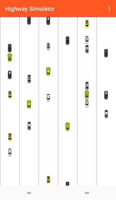
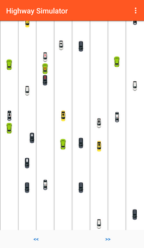

# AutoSimulator
Educational project representing highway traffic simulator.

# Screenshots

 

# Description
This is a student project illustrating classes interaction in OOP - each auto is a independent object making decisions by itself.

# Comments
- All code comments are in Russian, as the project was student's.
- Your feedback and pull requests are appreciated. Thanks!